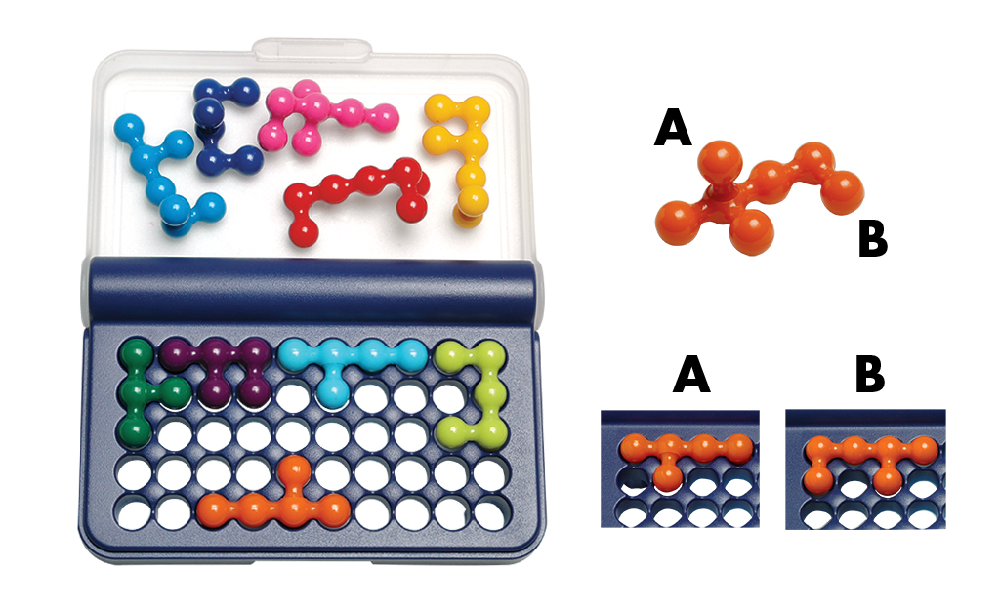
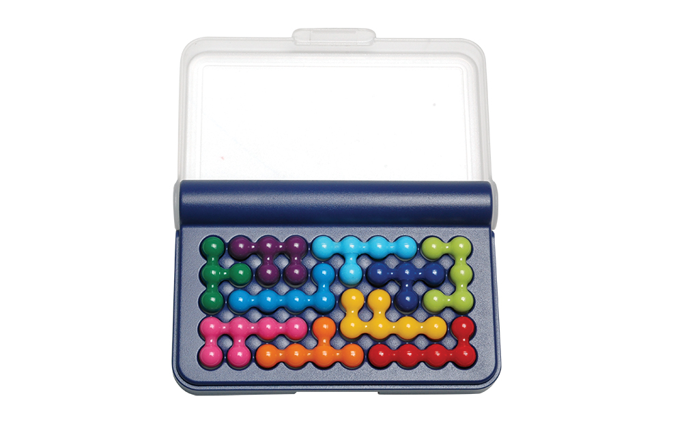
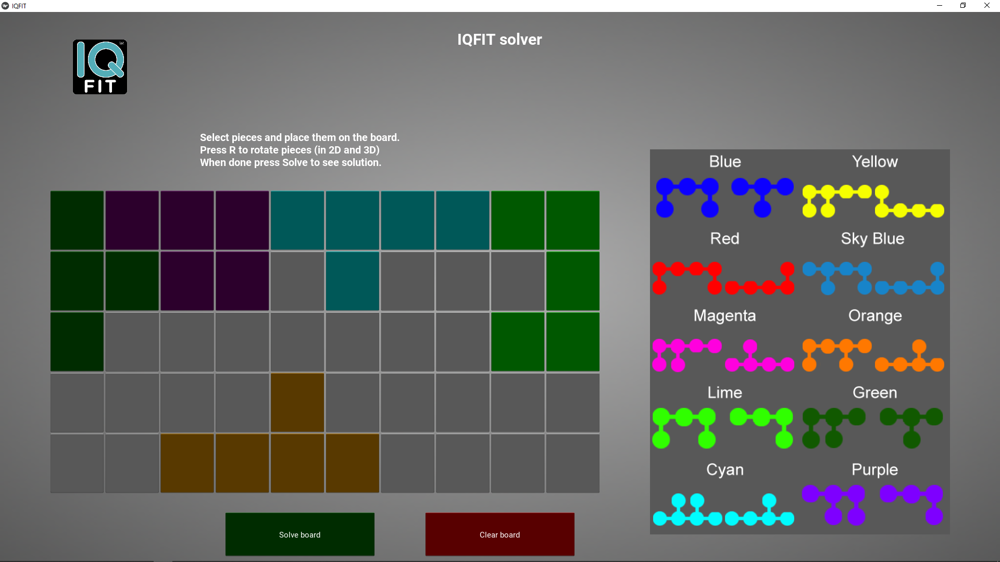
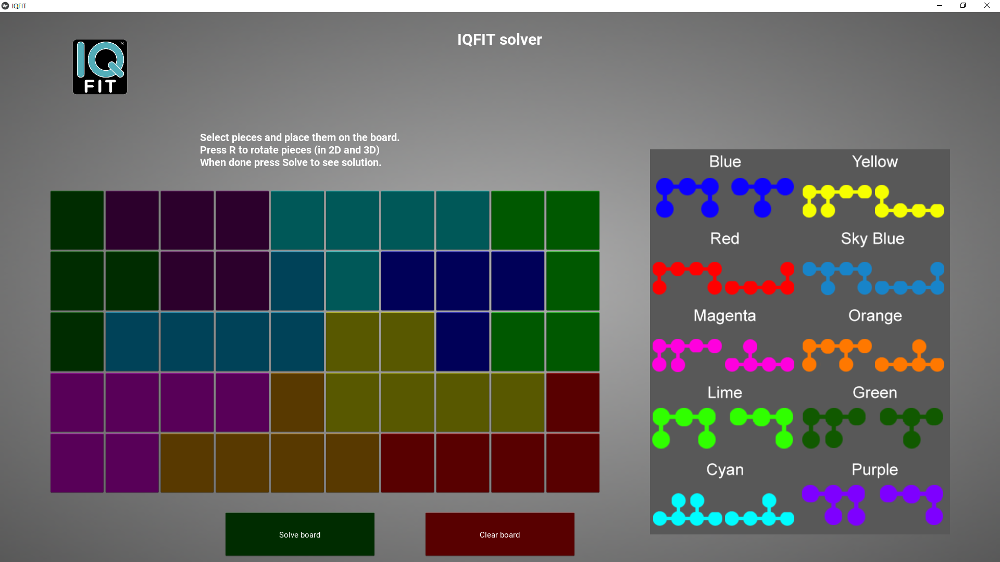

# iqfit-solver

 

## IQ FIT
[IQ FIT](https://www.smartgames.eu/uk/one-player-games/iq-fit) is a game made by [Smart Games®](https://www.smartgames.eu/uk) where one has fit all the 3D-puzzle pieces on the game board in such a way that it turns into a (flat) 2D-image.  
One of the protruding sides of each puzzle piece has 1 ball, the other side has 2 balls. So depending on how you orientate a puzzle piece, you get more or less balls. When solved, all puzzle pieces will fit on the game board without any holes uncovered.

Initial conditions         |  Final solution
:-------------------------:|:-------------------------:
|

## Solver

This repo is the implementation of a solver for the IQ FIT game in Python by translating this problem to an [exact cover problem](https://en.wikipedia.org/wiki/Exact_cover) and using Donal Knuth's Algorithm X [[arXiv:cs/0011047
]](https://arxiv.org/abs/cs/0011047).  
The implementation does not use Knuth's Dancing Links because Python dictionaries simplify the problem.

## Interactive app using Kivy

Interactive App to set initial conditions and display a solution (multiple solutions possible, the solver found 301350 solutions with an empty board as initial condition).

Initial conditions         |  Final solution
:-------------------------:|:-------------------------:
 Initial pieces are set on the board| The app displays the solution after pressing *Solve*

